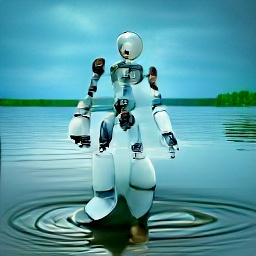
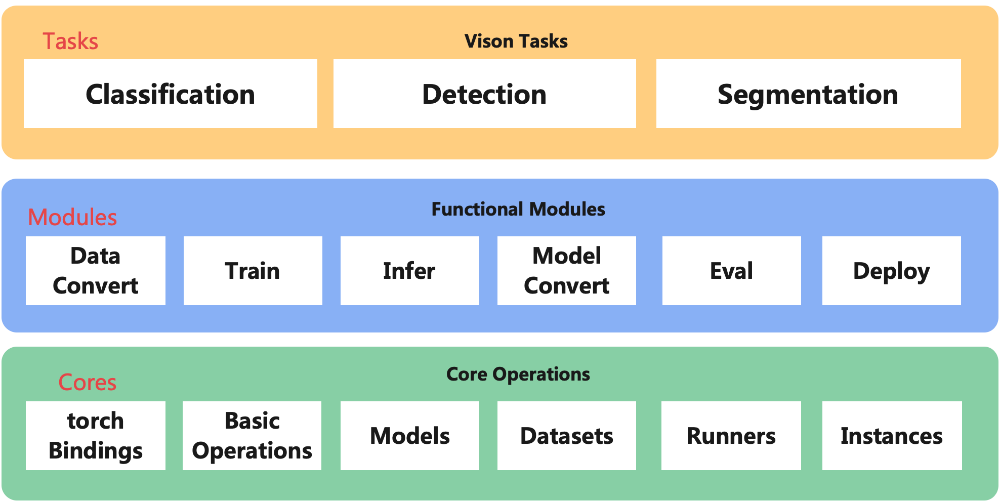

# RIVER

## Reconstruct Intelligent Vision Engine with Rust

 

- logo picture is created by text-to-image api . Page [deepai](https://deepai.org/machine-learning-model/text2img). Thanks to them.
- use some mods from [tch-rs](https://github.com/LaurentMazare/tch-rs). For instance,  nn, tensor, wrappers and etc. Thanks to them.
## System Architecture

- system architecture diagram

 

